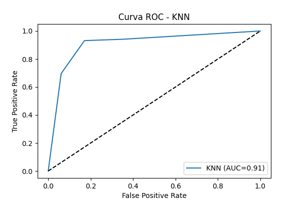
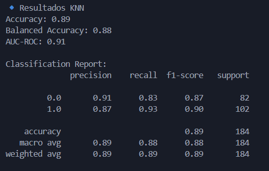
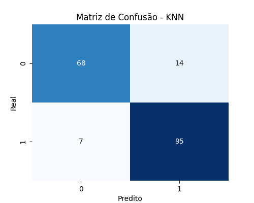
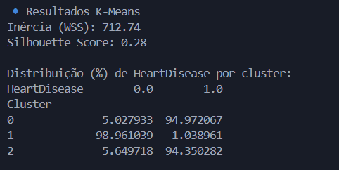
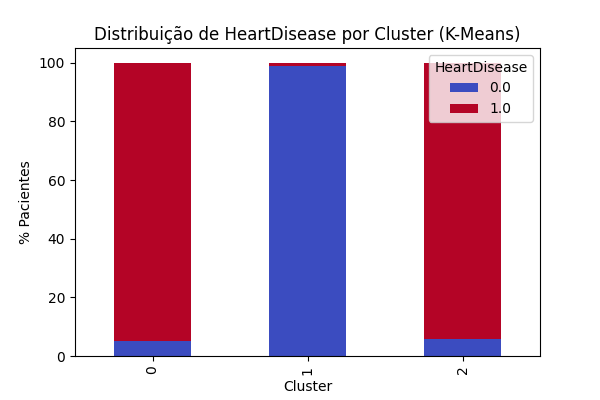

# Métricas - Doenças Cardiovasculares

---

**O [KNN](https://bligui.github.io/Machine-Learning-Ana/roteiro2/main/) e [K-Means](https://bligui.github.io/Machine-Learning-Ana/roteiro3/main/) já foram treinados e avaliados. Aqui apresentamos os resultados detalhados.**

---
!!! tip "Aviso"

    Não consegui exibir os códigos diretamente aqui porque meu Markdown não printou.
    Vou colocar o código completo no final da página, e os resultados aparecerão em imagens (prints) ao longo do documento.

    Observação: se você executar o código localmente, verá que os resultados estão corretos!

---

### Modelo Supervisionado: KNN (k=3)
O KNN é um modelo de aprendizado supervisionado, que prevê a classe de um paciente com base na proximidade de características em relação aos vizinhos mais próximos.

| Curva ROC | Resultados KNN |
|-----------|------------------|
|  |  |

- Acurácia: **0.89** - Indica que **89%** das previsões do modelo estão corretas.
- Balanced Accuracy: **0.88** - Ajusta a acurácia para desequilíbrios entre classes (importante em doenças raras).  
- AUC-ROC: **0.91** - Mede a capacidade do modelo de distinguir pacientes com e sem doença. Quanto mais próximo de 1, melhor.
---
### Detalhamento por Classe

- Classe **0** *(**Sem** doença)*
    - Precision: **0.91** - Das vezes que o modelo previu "sem doença", **91% estavam corretas.**
    - Recall: **0.83** - Identificou corretamente **83% dos pacientes realmente saudáveis.**
    - F1: **0.87** - Média harmônica entre Precision e Recall, bom equilíbrio.


- Classe **1** *(**Com** doença)*
    - Precision: **0.87** - Das vezes que o modelo previu "com doença", **87% estavam corretas.** 
    - Recall: **0.93** - Identificou corretamente **93% dos pacientes com doença** (muito importante clinicamente).
    - F1: **0.90** - Excelente equilíbrio para casos positivos.
---
### Matriz de Confusão
| Matriz de Confusão |
|-----------|
|  |

**Interpretação:**

- O modelo acerta principalmente os pacientes com doença (Recall=0.93), reduzindo o risco de falsos negativos, que é crítico na prática clínica.

- Pacientes saudáveis também são corretamente identificados na maioria das vezes (Precision 0.91).

---
### Modelo Não Supervisionado: K-Means (k=3)
O K-Means é um modelo não supervisionado, que agrupa pacientes em clusters com base em semelhanças de atributos, sem usar rótulos.

| Resultado K-Means | Clusters |
|-----------|------------------|
|  |  |

- Inércia (WSS): **704.09** - Quanto menor, melhor a compactação dos clusters.

- Silhouette Score: **0.28** - Mede a separação entre clusters (0.28 indica separação moderada).

**Interpretação:**

O K-Means conseguiu separar razoavelmente bem os grupos, formando:

- Um cluster quase exclusivo de pacientes saudáveis (Cluster 1).
- Dois clusters majoritariamente de pacientes com doença (Cluster 0 e 2).

Isso sugere que os atributos do dataset têm boa separabilidade natural entre doentes e não-doentes, mesmo sem supervisão.

---
### Conclusão
O KNN se destaca pela alta acurácia e recall para casos positivos, sendo ideal para aplicações médicas.

O K-Means confirma que os dados apresentam estrutura separável, mas com sobreposição entre grupos.

- O melhor modelo para predição clínica é o KNN (supervisionado).
- O K-Means pode ser útil para análises exploratórias e segmentação inicial.

---

### Código

=== "Code"

    ```python
    --8<-- "docs/roteiro4/codcompleto.py"
    ```