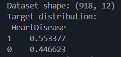
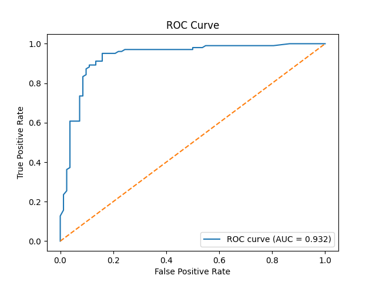
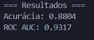
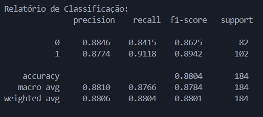
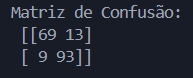
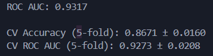
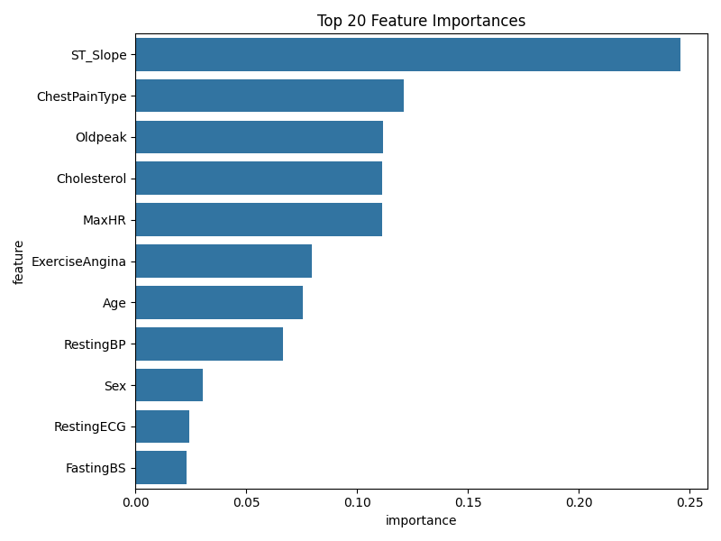
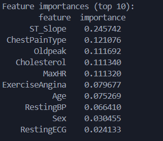

# Random Forest - Doenças Cardiovasculares
---
**O Pré-Processamento já foi feito e pode ser encontrado em: [Árvore de Decisão](https://bligui.github.io/Machine-Learning-Ana/roteiro1/main/#2-pre-processamento){:target='_blank'}**

---

A Random Forest é um modelo que combina várias árvores de decisão para prever, nessa base, se o paciente tem ou não doença cardíaca, analisando padrões em variáveis clínicas.

---

### Distribuição da Variável Alvo

| Variável Alvo |
|-----------|
|  |

- A base é relativamente balanceada, com cerca de **55,3% dos pacientes apresentando doença cardíaca** (`HeartDisease = 1`) e **44,7% sem doença** (`HeartDisease = 0`).
- Esse equilíbrio é bom, evita que o modelo aprenda vieses fortes, como por exemplo, prever 1 o tempo todo.
- O uso de `class_weight='balanced'` ainda é uma boa prática, pois ajuda a manter a sensibilidade para ambas as classes.

---

### Desempenho Geral do Modelo

| Curva ROC | Resultados Terminal |
|-----------|-----------|
|  |  |

- A acurácia de **88,04%** significa que o modelo acerta quase 9 em 10 previsões no conjunto teste.
- O ROC AUC de 0.9317 indica uma excelente capacidade discriminativa, isto é, o modelo distingue bem pacientes com ou sem doença.
    - Valores acima de 0.90 são considerados excelentes em problemas médicos.
    - Isso mostra que o modelo está equilibrado em termos de sensibilidade e especificidade.

---

### Relatório de Classificação

O modelo tem desempenho equilibrado entre prever quem tem e quem não tem a doença.
A ligeira vantagem no recall da classe “1” é desejável clinicamente (melhor errar por excesso de precaução do que deixar passar um caso).

| Resultados Terminal|
|-----------|
|  |

| Métrica | O que significa? | Classe 0 (sem doença) | Classe 1 (com doença) | Observação
|-----------|-----------|-----------|-----------|-----------|
| Precisão (precision) | Proporção de acertos entre as previsões positivas | 0.8846 | 0.8774 | Alta precisão em ambas as classes, o que indica poucas previsões erradas.|
| Recall (sensibilidade) | Proporção de acertos entre os casos reais | 0.8415 | 0.9118 | O modelo acerta 91% dos pacientes realmente doentes, excelente sensibilidade, importante para triagem médica.|
| F1-score | Média harmônica entre precisão e recall | 0.8625 | 0.8942 | Equilíbrio muito bom entre evitar falsos negativos e falsos positivos.|
| Macro avg / Weighted avg | Médias gerais (ponderadas) | ≈0.88 | ≈0.88 | Mostram desempenho consistente entre classes, sem enviesamento.|

---

### Matriz de Confusão
O número de falsos negativos é baixo, o que é ótimo em aplicações médicas (melhor alertar a mais do que deixar um caso passar).
O equilíbrio entre falsos positivos e negativos mostra que o modelo está bem calibrado.

| Resultados Terminal |
|-----------|
|  |

- 69 verdadeiros negativos (sem doença corretamente identificados).
- 93 verdadeiros positivos (com doença corretamente identificados).
- 13 falsos positivos (pessoas saudáveis classificadas como doentes).
- 9 falsos negativos (pacientes doentes classificados como saudáveis).

---
### Validação Cruzada

| Resultados Terminal |
|-----------|
|  |

- O modelo mantém acurácia média de **86,7%** e ROC AUC de **0.93** em diferentes divisões dos dados.
- O desvio-padrão baixo (≈0.02) mostra que o desempenho é estável e consistente, sem depender de uma partição específica do conjunto de treino/teste.
- Isso é um bom sinal de generalização, ou seja, o modelo não está “decorando” o treino (não há overfitting perceptível).

---
### Importância das variáveis (Top 10)
O modelo aprendeu padrões clinicamente plausíveis, reforçando que não está apenas “decorando” correlações artificiais.
As variáveis com maior peso são aquelas reconhecidas na cardiologia como marcadores de risco, indicando excelente sinal de validade interpretável.

| Importância das Variáveis | Resultados Terminal |
|-----------|-----------|
|  |  |

| Variável | Descrição | Interpretação |
|-----------|-----------|-----------|
| ST_Slope (24,6%) | Inclinação do segmento ST no ECG | É o fator mais relevante, reforçando que padrões de repolarização anormais estão fortemente ligados a doenças cardíacas.|
| ChestPainType (12,1%) | Tipo de dor torácica | Um dos sintomas clínicos mais importantes. Dor típica/assintomática é decisiva para o modelo.|
| Oldpeak (11,2%) | Depressão do ST | Outro sinal de isquemia cardíaca, a importância alta confirma coerência médica.|
| Cholesterol e MaxHR (≈11% cada) | Colesterol sérico e frequência máxima atingida | Condiz com a fisiologia: colesterol elevado e menor capacidade cardíaca aumentam risco.|
| ExerciseAngina (7,9%) | Angina induzida por exercício | Reforça que o esforço físico é preditor chave.|
| Age (7,5%) | Idade do paciente | Idade é relevante, mas não isoladamente determinante, o modelo captura interações com outros fatores.|
| RestingBP, Sex, RestingECG | Pressão arterial, sexo e ECG em repouso | Importância menor, mas contribuem ao contexto geral.|

---

### Síntese interpretativa geral

**Resumo:**

- Modelo: Random Forest Classifier (n=200 árvores, balanced class weight)

- Desempenho: Accuracy = 0.88, ROC AUC = 0.93, CV AUC ≈ 0.93 ± 0.02

- Erros: poucos falsos negativos (bom para triagem médica)

- Variáveis mais relevantes: **ST_Slope, ChestPainType, Oldpeak, Cholesterol, MaxHR**

### Conclusão
O modelo Random Forest treinado sobre o conjunto Heart Failure Prediction mostrou desempenho excelente e estabilidade consistente, com métricas de acurácia e AUC acima de 0.9.
Além de bom poder preditivo, a hierarquia das variáveis apresenta coerência clínica, com destaque para indicadores de isquemia e função cardíaca.
O comportamento balanceado entre precisão e recall o torna um modelo adequado para apoio diagnóstico inicial ou sistemas de triagem médica supervisionados por especialistas.