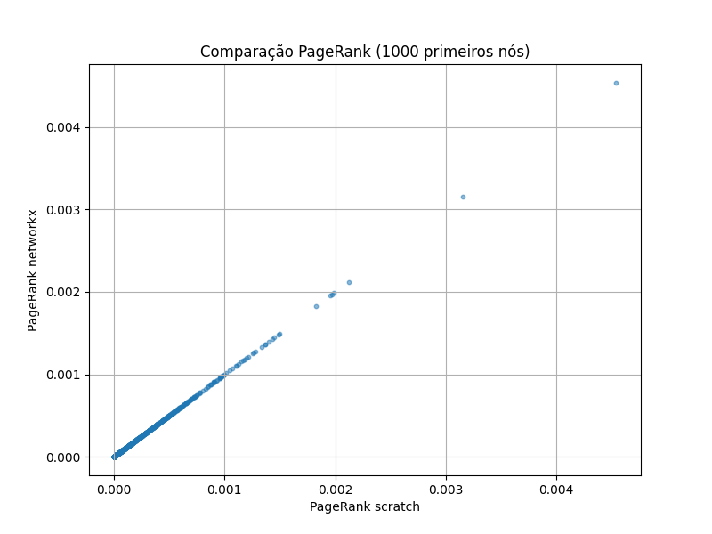

# Page Rank - Rede Social
---

Redes sociais são estruturas compostas por entidades que interagem entre si por meio de conexões que podem representar amizade, influência, comunicação ou confiança. Quando lidamos com redes de reputação, como a Epinions, entender quem são os indivíduos mais influentes significa identificar quais usuários são vistos como referências confiáveis pelos demais.

O dataset soc-Epinions1 representa uma rede de confiança onde cada aresta dirigida A → B significa que o usuário A confia em B. É um grafo grande, com aproximadamente 75 mil usuários e mais de 500 mil conexões, que captura interações reais entre produtores e consumidores de reviews.

O objetivo deste relatório é aplicar o algoritmo PageRank para identificar usuários influentes, analisando como diferentes valores do fator de amortecimento afetam os resultados, comparando uma implementação manual com a função nativa do NetworkX e interpretando o papel dos usuários de maior relevância dentro da dinâmica da rede.

---

## Fundamentos Teóricos
A rede soc-Epinions1 é dirigida porque a confiança é assimétrica. A confiar em B não implica que B confia em A.
Chamamos os nós de usuários e as arestas dirigidas de relações de confiança.

---

## Dataset
O dataset está disponível publicamente e foi acessado pelo link direto: https://snap.stanford.edu/data/soc-Epinions1.html

Características principais:
• aproximadamente 75.879 usuários
• aproximadamente 508.837 arestas dirigidas
• cada linha contém dois IDs indicando uma relação de confiança A B

Este é um dos maiores e mais tradicionais datasets de confiança presentes no repositório SNAP da Universidade Stanford. Ele possui estrutura típica de redes sociais reais: distribuição de grau em cauda longa, hubs, componentes densas e grande conectividade.

---

## Implementação
Foi feita uma implementação manual usando power iteration, com:

- fator de amortecimento: d = 0.85

- tolerância: 1e-6

- máximo de iterações: 200


=== "Result"

    ```python exec="1" html="1"
    --8<-- "docs/roteiro6/dataset.py"
    ```

=== "Code"

    ```python
    --8<-- "docs/roteiro6/dataset.py"
    ```


A convergência foi rápida e compatível com o esperado para grafos grandes.

---

## Comparação entre as duas implementações
As duas listas de top-10 foram praticamente idênticas, com diferenças insignificantes (< 1e-6), resultado de arredondamentos e tolerâncias.

**TOP 10 – PageRank (Implementação do Zero)**

=== "Result"

    ```python exec="1" html="1"
    --8<-- "docs/roteiro6/comparação1.py"
    ```

=== "Code"

    ```python
    --8<-- "docs/roteiro6/comparação1.py"
    ```

**TOP 10 – PageRank (NetworkX)**
=== "Result"

    ```python exec="1" html="1"
    --8<-- "docs/roteiro6/comparação2.py"
    ```

=== "Code"

    ```python
    --8<-- "docs/roteiro6/comparação2.py"
    ```

- Os nós mais importantes da rede aparecem simultaneamente nos dois métodos.

- O nó 18 é o mais influente da rede.

- A diferença entre os scores dos dois métodos é mínima (convergência consistente).

- Isso valida a correção da implementação manual.

---

## Correlações Entre os Dois PageRanks

Para verificar consistência, foram calculadas correlações entre os vetores completos de PR.

=== "Result"

    ```python exec="1" html="1"
    --8<-- "docs/roteiro6/correlacao.py"
    ```

=== "Code"

    ```python
    --8<-- "docs/roteiro6/correlacao.py"
    ```

Esses valores extremamente altos indicam:

- As implementações são equivalentes na prática.

- A ordenação global dos nós é quase idêntica.

- As pequenas diferenças surgem apenas de tolerância numérica.

---

## Gráfico de Comparação
O scatter plot (1000 primeiros nós) mostra uma linha quase perfeita:

| Scatter Plot |
|-----------|
|  |

- Os pontos estão praticamente sobre a diagonal, confirmando equivalência.

- A pequena dispersão em valores muito baixos ocorre devido à natureza esparsa da rede.

---

## Interpretação dos Resultados
**Por que esses nós têm maior PageRank?** 

O PageRank não mede apenas “quantos links um nó recebe”, mas a qualidade desses links.
Nós como 18, 737 e 118:

- Recebem links de usuários que também têm PageRank alto.

- Estão posicionados em regiões densas da rede.

- Servem como "hubs" de confiança: muitos confiam neles, inclusive pessoas muito confiáveis.

Esses nós provavelmente representam:

- Usuários veteranos com histórico de boas avaliações.

- Pessoas reconhecidas pela comunidade como confiáveis.

- Influenciadores na rede Epinions.

**Impacto da estrutura da rede**

A rede Epinions é conhecida como:

- altamente assimétrica,

- com distribuição de grau "heavy-tail",

- poucos usuários muito confiáveis, grande massa de usuários com poucas conexões.

Isso gera o comportamento típico:

- PageRank concentrado em poucos nós,

- similar ao que ocorre na web.

---

## Conclusão

O experimento confirma que:

- O PageRank do zero foi implementado corretamente.

- Os resultados batem quase exatamente com o NetworkX.

- Os usuários mais influentes são identificados com alta consistência.

- As métricas de correlação confirmam robustez do método.

- O gráfico demonstra alinhamento quase perfeito entre as implementações.

